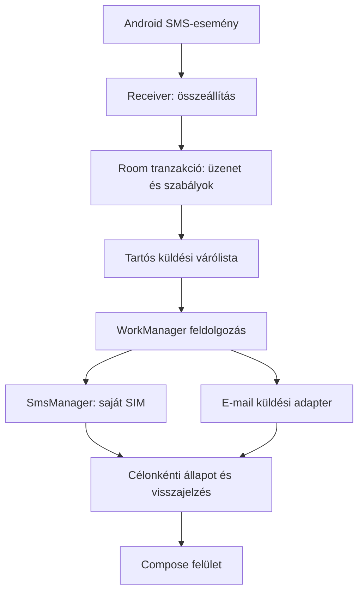

# Technikai terv

> 0.1-es megvalósítás: React + Capacitor kezelőfelület, Java Android SMS-adapter és SharedPreferences-tárolás. A következő Kotlin/Compose, Room és WorkManager architektúra az eredeti terv, nem a jelen build leírása. A futtatható verzió képességeit és korlátait a README rögzíti.

## Alapok

Natív Kotlin, Jetpack Compose és Material 3 felület, Room tárolás, WorkManager tartós háttérfeladatok, Android SmsManager küldés. Első körben egyetlen `app` Gradle-modul, csomagokra bontva; nincs szükség többmodulos vagy külön szerveres rendszerre a szabálymotorhoz. A pontos függőség-, SDK-, Kotlin- és Gradle-verziókat a projekt létrehozásakor kompatibilitás és elérhetőség alapján rögzítjük.

## Felelősségek

- `domain`: Androidtól független szabálymotor, feladó- és célnormalizálás, állapotátmenetek, limitpolitika.
- `data`: Room entitások, tranzakciók, repositoryk, beállítások.
- `platform/sms`: receiver, PDU-feldolgozás, SIM-választás, SmsManager, visszajelzések.
- `delivery`: feladatfoglalás, küldés és újrapróbálás; külön `SmsTransport` és `EmailTransport`.
- `ui`: képernyők, ViewModel és állapotmegjelenítés.

A receiver `goAsync()` használatával rövid, határidőn belüli feldolgozást végez, majd mindig lezárja a pending resultot. Nem végez hálózati küldést. Először tárol, utána ütemez. Mivel a Room tranzakció és WorkManager ütemezés nem egy tranzakció, induláskor és időszakos egyeztetéssel fel kell venni a tárolt, de nem ütemezett feladatokat. Ez nem folyamatos szolgáltatás és nem garantál azonnali kézbesítést.

## Adatmodell

| Entitás | Lényeges mezők |
|---|---|
| `Rule` | ID, név, enabled, feladó típusa/értéke, szövegszűrő, fogadó SIM, létrehozás/módosítás |
| `Destination` | ID, EMAIL/SMS típus, megjelenített és normalizált cím |
| `RuleDestination` | szabály–cél kapcsolat |
| `IncomingMessage` | UUID, platformesemény ujjlenyomata, feladó, szöveg, érkezési UTC-idő, fogadó SIM |
| `Delivery` | UUID, message ID, csatorna, cél és formázott szöveg pillanatképe, kimenő SIM, állapot, következő próbálkozás, foglalás lejárata |
| `DeliveryAttempt` | UUID, delivery ID, kezdet/vége, eredmény, hibakód, szolgáltatói azonosító |
| `SmsPart` | attempt ID, rész sorszáma, sent/delivered visszajelzés és hibakód |
| `SmsBudgetReservation` | napi keret azonosítója, delivery/attempt ID, lefoglalt szegmensek, véglegesített költségegység |

Egyedi adatbáziskulcs a `(messageId, channel, normalizedDestination)` hármasra. A küldési cél és szöveg pillanatkép: későbbi szabálymódosítás nem változtatja meg. Az időket UTC-ben tároljuk, a felületen helyi időben jelenítjük meg. A limit napját rögzített készülék-időzóna alapján számítjuk, az időzónaváltás nem nullázza az aktív keretet.

Beérkező esemény ismétlését a rendelkezésre álló eredeti PDU-k, időbélyegek, feladó és SIM együtteséből képzett ujjlenyomat kezeli. A puszta szövegegyezés nem elegendő. Az eseményazonosítás korlátait és a több rész összerakását teszttel és fizikai eszközön ellenőrizni kell; azonos tartalmú, eltérő eredeti eseményeket megőrizzük.

## Küldési állapotok

`QUEUED → IN_FLIGHT → SENT`, támogatott SMS-visszajelzésnél külön kézbesítési állapottal. Lehetséges elágazások: `RETRY_WAIT`, `BLOCKED`, `FAILED`, `UNKNOWN`, `CANCELED`.

- `RETRY_WAIT`: igazoltan átmeneti hiba, későbbi próbálkozás.
- `BLOCKED`: hiányzó engedély, SIM, e-mail-beállítás vagy keret; nincs végtelen automatikus próbálkozás.
- `FAILED`: végleges címzési vagy szolgáltatói hiba, illetve kimerült próbálkozási keret.
- `UNKNOWN`: nem bizonyítható, hogy történt-e küldés; SMS-nél nincs automatikus ismétlés.

Feladatfoglalás atomikus Room művelettel; párhuzamos workerek nem küldhetik egyszerre ugyanazt. A foglalás lejárata SMS átadása után nem enged vak újraküldést. Folyamatleállás után SMS `IN_FLIGHT` állapotban konzervatívan `UNKNOWN`, amíg a visszajelzés nem igazolja a kimenetelt. Az SMS sent/delivered PendingIntentek egyediek küldési kísérletenként és részenként, explicit alkalmazáson belüli célra mutatnak. Az adott SDK által megkövetelt mutability/export beállításokat teszteljük.

Többrészes kimenő SMS csak valamennyi rész sikeres sent visszajelzésével `SENT`. Részleges küldésnél nincs teljes automatikus újraküldés; a UI jelzi a hiányt és a kézi ismétlés kockázatát. Visszajelzési időtúllépés `UNKNOWN`, nem siker.

## Újrapróbálás és limitek

E-mailhez hálózatfeltétel, exponenciális késleltetés, legfeljebb öt automatikus kísérlet; az offline várakozás önmagában nem kísérlet. A WorkManager időzítése nem percre pontos. SMTP vagy nem idempotens API bizonytalan elfogadása után `UNKNOWN`; idempotens átjárón ugyanazzal a kulccsal ismételhető a kérés.

SMS-szegmensszám a teljes formázott szövegből, a platform darabolásával. Küldés előtt tranzakciós foglalás a napi keretben. A bizonytalanul már elküldött részeket a keretből nem szabad automatikusan felszabadítani. Kézi ismétlés is a keretbe számít. Küldés előtt újra ellenőrizzük a globális szünetet és a feladat aktuális állapotát.

Önmagunkra továbbítás tiltása a konfigurált eszközszámok alapján; a SIM saját száma nem mindig olvasható. Továbbított SMS felismerhető jelölést kap; ezt fogadó, együttműködő SMSFWD-példány alapértelmezésben nem továbbítja újra. Ez nem teljes hurokgarancia külső rendszereknél, ezért a napi limit is szükséges. Általános, időablakos szövegazonosság miatti eldobást nem alkalmazunk.

## E-mail-adapter

A szolgáltató kiválasztása nyitott. Közvetlen OAuth-alapú céges küldés vagy támogatott, TLS-sel védett SMTP használható, ha a céges beállítások engedik. Microsoft/Google integrációnál szükség lehet alkalmazásregisztrációra és admin-hozzájárulásra. Nem feltételezünk elérhető jelszavas SMTP-t.

Ha közös szerveroldali hitelesítés kell, kis átjáró interfésze: `POST /v1/deliveries`, hitelesített eszköz, `Idempotency-Key`, címzett, eredeti feladó, érkezési idő, szöveg. Tartós fogadásra `202` és delivery ID; külön állapotlekérés. A `202` csak „átjáró átvette”, nem „e-mail elküldve”. Ugyanaz a kulcs azonos tartalommal ugyanazt az eredményt adja; eltérő tartalommal konfliktus. Az átjáró csak akkor lesz tényleges komponens, ha szükséges.

Hitelesítési anyag nincs a forrásban vagy APK-ba égetve. Tokeneket alkalmazásprivát tárolással és Android Keystore által védett kulccsal kezeljük; a levelezési SDK hitelesítési tárolóját használjuk, ahol támogatott. A várólista helyi adatbázisa és a hitelesítési adatok nem kerülnek automatikus eszközmentésbe. Logokban nincs SMS-szöveg vagy token.

## Android és eszköztesztek

RECEIVE_SMS futásidejű engedély; SEND_SMS csak SMS-cél esetén; INTERNET e-mailhez. Értesítési engedély csak értesítési funkcióhoz. Dual SIM listázásához szükséges további telephony-engedélyek célzottan kérendők. READ_SMS nem kell az új eseményekhez.

A kimenő subscription ID nem tekinthető örök azonosítónak. SIM-csere és hiányzó kiválasztott SIM esetén a küldés blokkolódik; nincs néma átváltás másik SIM-re. Dual-SIM beállítást fizikai eszközön kell igazolni.

Az első változat feloldott felhasználói tárolást használ; újraindítás utáni első feloldás előtti működés nem vállalt. Gyártói háttérkorlátozások és kényszerleállítás miatt feltétel nélküli működés nem garantálható. Nem építünk alapértelmezetten folyamatos foreground service-t.
